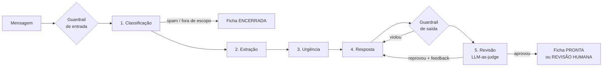

# Triagem Jurídica: sistema de prompts para atendimento em escritórios de advocacia

Projeto prático do Módulo 2 (Prompt Engineering System for Real Business Application).

## O problema

Escritórios de advocacia de pequeno e médio porte recebem dezenas de contatos por dia
por e-mail, WhatsApp e pelo formulário do site. Hoje alguém da equipe lê cada mensagem e
decide manualmente:

- se é um caso novo, um cliente atual, uma dúvida, spam ou algo sem relação com direito;
- qual área deve atender;
- se há **prazo correndo** (uma prisão em flagrante, uma audiência amanhã, uma
  prescrição perto do fim);
- como responder sem violar as regras de publicidade da OAB (não prometer resultado, não
  divulgar honorários, não dar parecer antes da consulta).

Quando essa triagem é feita com pressa, casos urgentes ficam na fila, o cliente espera
dias por uma resposta genérica, e às vezes alguém promete o que não deveria.

## A solução

Um pipeline de 5 prompts especializados que recebe a mensagem bruta e devolve uma
**ficha de triagem** estruturada: classificação, fatos extraídos, nível de urgência com
justificativa, e um rascunho de resposta ao cliente já revisado quanto à conformidade.



A decisão final é sempre de uma pessoa: o sistema prioriza a fila e prepara o rascunho.
Casos críticos, classificações com baixa confiança e respostas que não passaram na
revisão vão com status `revisao_humana` e um alerta explicando o motivo.

## Estrutura

```
src/triagem_juridica/
├── prompts/                 ← a biblioteca de prompts (YAML versionado)
│   ├── classificacao.yaml
│   ├── extracao.yaml
│   ├── urgencia.yaml
│   ├── resposta.yaml
│   ├── revisao.yaml
│   └── partials/regras_comunicacao.txt   ← regras da OAB compartilhadas
├── prompt_library.py        ← carrega, valida e renderiza os prompts
├── schemas.py               ← contratos Pydantic de cada etapa (structured outputs)
├── llm.py                   ← adaptador da API Anthropic + LLM falso para testes
├── guardrails.py            ← verificações determinísticas de entrada e saída
├── pipeline.py              ← orquestração multi-etapas
└── cli.py                   ← linha de comando `triagem`
tests/                       ← 97 testes offline + testes live opcionais
evals/                       ← golden set e avaliador contra a API real
examples/                    ← mensagens de exemplo, demo offline, uso como biblioteca
docs/                        ← arquitetura e catálogo de prompts/técnicas
```

## Instalação

Requer Python 3.12+ e [uv](https://docs.astral.sh/uv/).

```bash
uv sync
```

## Uso

Para ver a biblioteca e inspecionar um prompt sem chamar a API:

```bash
uv run triagem prompts
```

```bash
uv run triagem renderizar classificacao --var canal=email --var mensagem="Fui demitido"
```

Para ver uma demonstração offline do pipeline completo (as saídas do modelo são simuladas):

```bash
uv run python examples/demo_offline.py
```

Para processar uma mensagem real, é preciso ter uma chave da API:

```bash
export ANTHROPIC_API_KEY=sk-ant-...
```

```bash
uv run triagem processar examples/mensagens/criminal_whatsapp.txt --canal whatsapp
```

Também dá para usar como biblioteca Python (veja `examples/uso_programatico.py`):

```python
from triagem_juridica import AnthropicLLM, PipelineTriagem

ficha = PipelineTriagem(AnthropicLLM()).processar(mensagem, canal="whatsapp")
ficha.status  # pronta_para_envio | revisao_humana | encerrada
ficha.urgencia  # nível, fundamentação, riscos, ação recomendada
ficha.resposta  # rascunho revisado para o cliente
```

O modelo padrão é `claude-opus-5` e pode ser trocado com `TRIAGEM_MODELO` ou `--modelo`.

## Testes

```bash
uv run pytest
```

São 97 testes que rodam em menos de 1 segundo, sem rede e sem custo. O `LLMFalso`
substitui a API por respostas roteirizadas, o que permite testar de forma determinística:

| Arquivo | O que garante |
|---|---|
| `test_biblioteca.py` | todo prompt carrega e valida; variáveis faltando ou sobrando falham; exemplos few-shot respeitam o schema; system prompt estável (cacheável); nenhum prompt pede raciocínio na saída; injeção de tags é neutralizada; gerador e revisor usam as mesmas regras |
| `test_pipeline.py` | ordem das etapas; saída de uma etapa chega à seguinte; spam encerra cedo; ciclo de correção com feedback; limite de tentativas; urgência crítica e baixa confiança vão para humano; falha do modelo não derruba a triagem |
| `test_guardrails.py` | detecção de promessa de resultado, valores, pedido de dados sensíveis e excesso de palavras por canal, e ausência de falsos positivos em frases legítimas |
| `test_llm.py` | parâmetros enviados à API (schema, effort, fallback); recusa e truncamento viram erros tipados |
| `test_evals.py` | o golden set é bem formado e o avaliador pontua corretamente |

### Avaliação com o modelo real

Os testes acima verificam o **sistema**. A qualidade dos **outputs do modelo** é medida
em `evals/`, com um golden set de 10 casos que cobre todos os tipos de contato, casos
críticos e uma tentativa de prompt injection:

```bash
uv run pytest -m live
```

```bash
uv run python evals/rodar_evals.py --repeticoes 3
```

O primeiro comando é um teste de fumaça com 3 casos. O segundo roda o golden set
completo 3 vezes e mede acurácia de tipo e área, urgência segura (nunca abaixo do mínimo
esperado), conformidade da resposta e **consistência** (se as repetições concordam entre
si).

## Critérios de aceitação

| Critério | Onde está |
|---|---|
| Prompts estruturados | YAML com metadados, system/user separados, seções em tags XML ([docs/prompts.md](docs/prompts.md)) |
| Técnicas avançadas | few-shot, raciocínio interno com effort por etapa, structured outputs, prompt chaining, LLM-as-judge, reflexão com feedback, rubricas, grounding, defesa contra injection ([docs/prompts.md](docs/prompts.md#técnicas-por-prompt)) |
| Pipeline multi-step | `pipeline.py`: 5 etapas com roteamento condicional e ciclo de correção |
| Sistema de testes | `tests/` (offline, determinístico) + `evals/` (qualidade com o modelo real) |
| Modularidade | prompts desacoplados do código, partials compartilhados, LLM injetável, cada prompt utilizável isoladamente |
| Outputs consistentes | structured outputs com enums, guardrails determinísticos, métrica de consistência nos evals |
| Problema real | triagem de contatos em escritórios de advocacia, com as regras de publicidade da OAB |

## Resultados com o modelo real

Avaliação completa em 2026-09-23, com `claude-opus-5`: golden set de 10 casos, 3
repetições cada (`evals/rodar_evals.py --repeticoes 3`).

| Métrica | Resultado |
|---|---|
| Tipo de contato correto | 30/30 (100%) |
| Área do direito correta | 27/27 (100%) |
| Urgência segura (nunca abaixo do mínimo) | 24/24 (100%) |
| Consistência entre repetições (mesmo tipo, área e urgência) | 10/10 (100%) |
| Conformidade da resposta | 22/24 (92%) → 100% após correção do guardrail |

As 2 falhas de conformidade eram falsos positivos do guardrail em regex, e não erros do
modelo: ele bloqueava a repetição do valor da dívida citada pelo cliente ("dívida de
R$ 890") e um aviso de segurança ("não envie dados bancários"). As regras R2 e R5 passaram
a considerar o contexto, e os dois textos viraram testes de regressão. Os dois casos foram
reexecutados 3 vezes: todas as rodadas concluídas passaram na conformidade (uma rodada foi
interrompida por falta de créditos na conta da API).

O relatório completo, com todas as fichas geradas, está em
[evals/relatorios/2026-09-23-avaliacao-completa.json](evals/relatorios/2026-09-23-avaliacao-completa.json).
A reexecução dos 2 casos após a correção do guardrail está em
[evals/relatorios/2026-09-23-reexecucao-guardrail.json](evals/relatorios/2026-09-23-reexecucao-guardrail.json).

A primeira execução real também revelou dois problemas de design nos prompts, já corrigidos
e documentados em [docs/arquitetura.md](docs/arquitetura.md#lições-da-execução-real).

## Documentação

- [docs/arquitetura.md](docs/arquitetura.md): decisões de design e fluxo de dados
- [docs/prompts.md](docs/prompts.md): catálogo de prompts, técnicas usadas e como criar
  ou versionar um prompt
